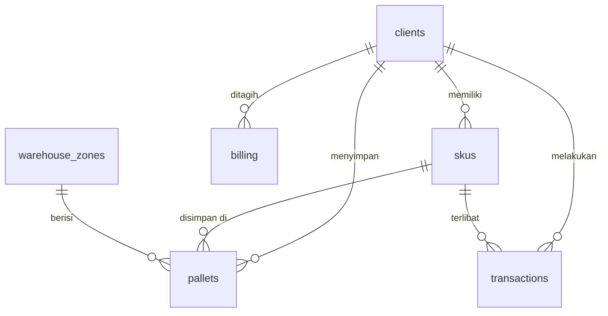

# Supabase PostgreSQL Schema — Hybrid Warehouse Fulfillment

Schema ini dirancang agar 1:1 dengan TypeScript types yang sudah ada di `src/types/index.ts`.

---

## ER Diagram



---

## 1. Enum Types

```sql
-- Buat enum dulu sebelum create table
CREATE TYPE client_type AS ENUM ('space', 'fulfillment', 'hybrid');
CREATE TYPE contract_type AS ENUM ('reguler', 'group');
CREATE TYPE client_status AS ENUM ('active', 'inactive');
CREATE TYPE stock_status AS ENUM ('aman', 'menipis', 'kritis');
CREATE TYPE sku_category AS ENUM ('buku', 'atk', 'modul_digital', 'elektronik', 'lainnya');
CREATE TYPE sku_size_category AS ENUM ('small', 'medium', 'large');
CREATE TYPE order_status AS ENUM ('pending', 'picking', 'packing', 'shipped', 'cancelled');
CREATE TYPE transaction_type AS ENUM ('inbound', 'outbound', 'return', 'withdrawal', 'expired');
CREATE TYPE pallet_status AS ENUM ('active', 'dead_stock');
CREATE TYPE billing_status AS ENUM ('draft', 'sent', 'paid');
```

---

## 2. Core Tables

### `clients`
```sql
CREATE TABLE clients (
  id            UUID PRIMARY KEY DEFAULT gen_random_uuid(),
  name          TEXT NOT NULL,
  type          client_type NOT NULL,
  contract_type contract_type NOT NULL DEFAULT 'reguler',
  contact_person TEXT NOT NULL DEFAULT '',
  phone         TEXT NOT NULL DEFAULT '',
  address       TEXT NOT NULL DEFAULT '',
  area_m2       NUMERIC(10,2) NOT NULL CHECK (area_m2 > 0),
  rack_levels   INT NOT NULL DEFAULT 3 CHECK (rack_levels BETWEEN 1 AND 5),
  rate_per_m2   NUMERIC(10,0) NOT NULL,
  status        client_status NOT NULL DEFAULT 'active',
  join_date     DATE NOT NULL DEFAULT CURRENT_DATE,
  contract_start DATE NOT NULL,
  contract_end   DATE NOT NULL,
  minimum_billing NUMERIC(12,0) NOT NULL DEFAULT 0,
  created_at    TIMESTAMPTZ NOT NULL DEFAULT NOW(),
  updated_at    TIMESTAMPTZ NOT NULL DEFAULT NOW(),

  CONSTRAINT valid_contract CHECK (contract_end > contract_start)
);

-- Auto-set rate berdasarkan contract type
COMMENT ON COLUMN clients.rate_per_m2 IS 
  'Reguler: 38000, Group: 36000 — set via app logic or trigger';
```

### `skus`
```sql
CREATE TABLE skus (
  id            UUID PRIMARY KEY DEFAULT gen_random_uuid(),
  client_id     UUID NOT NULL REFERENCES clients(id) ON DELETE CASCADE,
  sku_code      TEXT NOT NULL,
  name          TEXT NOT NULL,
  category      sku_category NOT NULL DEFAULT 'lainnya',
  unit          TEXT NOT NULL DEFAULT 'pcs',
  stock_qty     INT NOT NULL DEFAULT 0 CHECK (stock_qty >= 0),
  min_stock     INT NOT NULL DEFAULT 0,
  status        stock_status NOT NULL DEFAULT 'aman',
  weight_kg     NUMERIC(6,2) NOT NULL DEFAULT 0.5,
  dimension_cm3 NUMERIC(10,0) NOT NULL DEFAULT 1000,
  size_category sku_size_category NOT NULL DEFAULT 'small',
  last_updated  TIMESTAMPTZ NOT NULL DEFAULT NOW(),
  created_at    TIMESTAMPTZ NOT NULL DEFAULT NOW(),

  CONSTRAINT unique_sku_per_client UNIQUE (client_id, sku_code)
);

-- Auto-compute stock status via trigger
CREATE OR REPLACE FUNCTION update_stock_status()
RETURNS TRIGGER AS $$
BEGIN
  IF NEW.stock_qty <= NEW.min_stock * 0.5 THEN
    NEW.status := 'kritis';
  ELSIF NEW.stock_qty <= NEW.min_stock THEN
    NEW.status := 'menipis';
  ELSE
    NEW.status := 'aman';
  END IF;
  NEW.last_updated := NOW();
  RETURN NEW;
END;
$$ LANGUAGE plpgsql;

CREATE TRIGGER trg_stock_status
  BEFORE INSERT OR UPDATE OF stock_qty, min_stock ON skus
  FOR EACH ROW EXECUTE FUNCTION update_stock_status();
```

### `pallets`
```sql
CREATE TABLE pallets (
  id            UUID PRIMARY KEY DEFAULT gen_random_uuid(),
  client_id     UUID NOT NULL REFERENCES clients(id) ON DELETE CASCADE,
  sku_id        UUID NOT NULL REFERENCES skus(id) ON DELETE CASCADE,
  zone          TEXT NOT NULL CHECK (zone IN ('space', 'fulfillment')),
  position      TEXT NOT NULL,                  -- e.g. 'A-01'
  inbound_date  DATE NOT NULL DEFAULT CURRENT_DATE,
  last_move_date DATE NOT NULL DEFAULT CURRENT_DATE,
  qty           INT NOT NULL DEFAULT 0 CHECK (qty >= 0),
  status        pallet_status NOT NULL DEFAULT 'active',
  created_at    TIMESTAMPTZ NOT NULL DEFAULT NOW(),

  CONSTRAINT unique_position_per_zone UNIQUE (zone, position)
);

-- Auto-flag dead stock (>90 hari tidak bergerak)
CREATE OR REPLACE FUNCTION update_pallet_dead_stock()
RETURNS TRIGGER AS $$
BEGIN
  IF (CURRENT_DATE - NEW.last_move_date) > 90 THEN
    NEW.status := 'dead_stock';
  ELSE
    NEW.status := 'active';
  END IF;
  RETURN NEW;
END;
$$ LANGUAGE plpgsql;

CREATE TRIGGER trg_dead_stock
  BEFORE INSERT OR UPDATE OF last_move_date ON pallets
  FOR EACH ROW EXECUTE FUNCTION update_pallet_dead_stock();
```

### `transactions`
```sql
CREATE TABLE transactions (
  id            UUID PRIMARY KEY DEFAULT gen_random_uuid(),
  client_id     UUID NOT NULL REFERENCES clients(id) ON DELETE CASCADE,
  sku_id        UUID NOT NULL REFERENCES skus(id) ON DELETE CASCADE,
  type          transaction_type NOT NULL,
  qty           INT NOT NULL CHECK (qty > 0),
  fee           NUMERIC(12,0) NOT NULL DEFAULT 0,
  status        order_status NOT NULL DEFAULT 'pending',
  date          DATE NOT NULL DEFAULT CURRENT_DATE,
  notes         TEXT,
  created_at    TIMESTAMPTZ NOT NULL DEFAULT NOW()
);
```

### `billing`
```sql
CREATE TABLE billing (
  id                      UUID PRIMARY KEY DEFAULT gen_random_uuid(),
  client_id               UUID NOT NULL REFERENCES clients(id) ON DELETE CASCADE,
  billing_month           TEXT NOT NULL,  -- format: '2025-05'
  storage_fee             NUMERIC(12,0) NOT NULL DEFAULT 0,
  inbound_fee             NUMERIC(12,0) NOT NULL DEFAULT 0,
  outbound_fee            NUMERIC(12,0) NOT NULL DEFAULT 0,
  picking_packing_fee     NUMERIC(12,0) NOT NULL DEFAULT 0,
  return_fee              NUMERIC(12,0) NOT NULL DEFAULT 0,
  expired_fee             NUMERIC(12,0) NOT NULL DEFAULT 0,
  withdrawal_fee          NUMERIC(12,0) NOT NULL DEFAULT 0,
  dead_stock_fee          NUMERIC(12,0) NOT NULL DEFAULT 0,
  total_fee               NUMERIC(14,0) NOT NULL DEFAULT 0,
  minimum_billing_applied BOOLEAN NOT NULL DEFAULT FALSE,
  status                  billing_status NOT NULL DEFAULT 'draft',
  created_at              TIMESTAMPTZ NOT NULL DEFAULT NOW(),
  updated_at              TIMESTAMPTZ NOT NULL DEFAULT NOW(),

  CONSTRAINT unique_billing_per_month UNIQUE (client_id, billing_month)
);
```

### `warehouse_zones`
```sql
CREATE TABLE warehouse_zones (
  id            UUID PRIMARY KEY DEFAULT gen_random_uuid(),
  name          TEXT NOT NULL UNIQUE,           -- 'space' | 'fulfillment'
  area_m2       NUMERIC(10,2) NOT NULL,
  rack_levels   INT NOT NULL DEFAULT 3,
  max_pallets   INT NOT NULL DEFAULT 70
);

-- Seed data
INSERT INTO warehouse_zones (name, area_m2, rack_levels, max_pallets) VALUES
  ('space', 360, 3, 70),
  ('fulfillment', 360, 3, 70);
```

### `warehouse_config` (singleton)
```sql
CREATE TABLE warehouse_config (
  id                BOOLEAN PRIMARY KEY DEFAULT TRUE CHECK (id = TRUE), -- hanya 1 row
  total_area_m2     NUMERIC(10,2) NOT NULL DEFAULT 1200,
  effective_area_m2 NUMERIC(10,2) NOT NULL DEFAULT 720,
  utilization_ratio NUMERIC(4,2) NOT NULL DEFAULT 0.60,
  address           TEXT NOT NULL DEFAULT 'Jombang, Jawa Timur'
);

INSERT INTO warehouse_config DEFAULT VALUES;
```

---

## 3. Indexes (Performance)

```sql
-- Query yang sering: filter by client + month
CREATE INDEX idx_transactions_client_date ON transactions (client_id, date);
CREATE INDEX idx_billing_client_month ON billing (client_id, billing_month);
CREATE INDEX idx_skus_client ON skus (client_id);
CREATE INDEX idx_pallets_client ON pallets (client_id);
CREATE INDEX idx_pallets_zone ON pallets (zone);
CREATE INDEX idx_pallets_status ON pallets (status);
CREATE INDEX idx_clients_status ON clients (status);

-- Full-text search untuk SKU name
CREATE INDEX idx_skus_name_search ON skus USING gin(to_tsvector('indonesian', name));
```

---

## 4. Views (KPI Ready)

```sql
-- Dashboard KPI view
CREATE VIEW v_dashboard_kpi AS
SELECT
  -- KPI-01: Profit per m²
  ROUND(
    SUM(b.total_fee) * 0.80 / NULLIF(wc.effective_area_m2, 0)
  ) AS profit_per_m2,

  -- KPI-02: Utilization
  ROUND(
    COUNT(CASE WHEN p.status = 'active' THEN 1 END)::NUMERIC
    / NULLIF(COUNT(p.id), 0) * 100, 1
  ) AS utilization_pct,

  -- KPI-04: Dead stock ratio
  ROUND(
    COUNT(CASE WHEN p.status = 'dead_stock' THEN 1 END)::NUMERIC
    / NULLIF(COUNT(p.id), 0) * 100, 1
  ) AS dead_stock_pct,

  -- KPI-05: Client retention
  ROUND(
    COUNT(CASE WHEN c.status = 'active' THEN 1 END)::NUMERIC
    / NULLIF(COUNT(c.id), 0) * 100, 0
  ) AS retention_pct

FROM warehouse_config wc
CROSS JOIN billing b
CROSS JOIN pallets p
CROSS JOIN clients c
WHERE b.billing_month = to_char(CURRENT_DATE, 'YYYY-MM');

-- Billing breakdown per client
CREATE VIEW v_client_billing AS
SELECT
  b.*,
  c.name AS client_name,
  c.type AS client_type,
  c.minimum_billing
FROM billing b
JOIN clients c ON c.id = b.client_id
ORDER BY b.total_fee DESC;
```

---

## 5. Row Level Security (RLS)

```sql
-- Enable RLS on all tables
ALTER TABLE clients ENABLE ROW LEVEL SECURITY;
ALTER TABLE skus ENABLE ROW LEVEL SECURITY;
ALTER TABLE pallets ENABLE ROW LEVEL SECURITY;
ALTER TABLE transactions ENABLE ROW LEVEL SECURITY;
ALTER TABLE billing ENABLE ROW LEVEL SECURITY;

-- Untuk MVP: allow all authenticated users (single-tenant warehouse)
CREATE POLICY "Authenticated read all" ON clients
  FOR SELECT TO authenticated USING (true);

CREATE POLICY "Authenticated read all" ON skus
  FOR SELECT TO authenticated USING (true);

CREATE POLICY "Authenticated read all" ON pallets
  FOR SELECT TO authenticated USING (true);

CREATE POLICY "Authenticated read all" ON transactions
  FOR SELECT TO authenticated USING (true);

CREATE POLICY "Authenticated read all" ON billing
  FOR SELECT TO authenticated USING (true);

-- Write access: hanya admin role
CREATE POLICY "Admin write" ON clients
  FOR ALL TO authenticated
  USING (auth.jwt() ->> 'role' = 'admin')
  WITH CHECK (auth.jwt() ->> 'role' = 'admin');

-- Ulangi pattern ini untuk tabel lain...
```

---

## 6. Mapping TypeScript → PostgreSQL

| TypeScript Type | Postgres Table | Notes |
|---|---|---|
| `Client` | `clients` | camelCase → snake_case |
| `SKU` | `skus` | `clientId` → `client_id` |
| `Pallet` | `pallets` | trigger auto-flag dead stock |
| `Transaction` | `transactions` | - |
| `BillingItem` | `billing` | trigger bisa auto-compute total |
| `WarehouseConfig` | `warehouse_config` | singleton (1 row) |
| `WarehouseZone` | `warehouse_zones` | 2 rows: space + fulfillment |

---

## 7. Migration Order

Jalankan di Supabase SQL Editor sesuai urutan:

1. **Enum types** (semua `CREATE TYPE`)
2. **`warehouse_config`** + **`warehouse_zones`** (no FK)
3. **`clients`** (no FK)
4. **`skus`** (FK → clients)
5. **`pallets`** (FK → clients, skus)
6. **`transactions`** (FK → clients, skus)
7. **`billing`** (FK → clients)
8. **Triggers** (stock status, dead stock)
9. **Indexes**
10. **Views**
11. **RLS policies**

---

## 8. Supabase Client Integration (Next.js)

```typescript
// src/lib/supabase.ts
import { createClient } from '@supabase/supabase-js'
import type { Database } from '@/types/database' // auto-generated

export const supabase = createClient<Database>(
  process.env.NEXT_PUBLIC_SUPABASE_URL!,
  process.env.NEXT_PUBLIC_SUPABASE_ANON_KEY!
)

// Contoh query
const { data: clients } = await supabase
  .from('clients')
  .select('*')
  .eq('status', 'active')
  .order('name')
```

> [!TIP]
> Gunakan `npx supabase gen types typescript` untuk auto-generate TypeScript types dari schema PostgreSQL. Ini menggantikan manual types di `src/types/index.ts`.

> [!IMPORTANT]
> Saat migrasi dari mock JSON ke Supabase, ganti semua `import xxxData from '@/data/mock/xxx.json'` dengan Supabase queries. Komponen tetap sama — hanya data source yang berubah.
